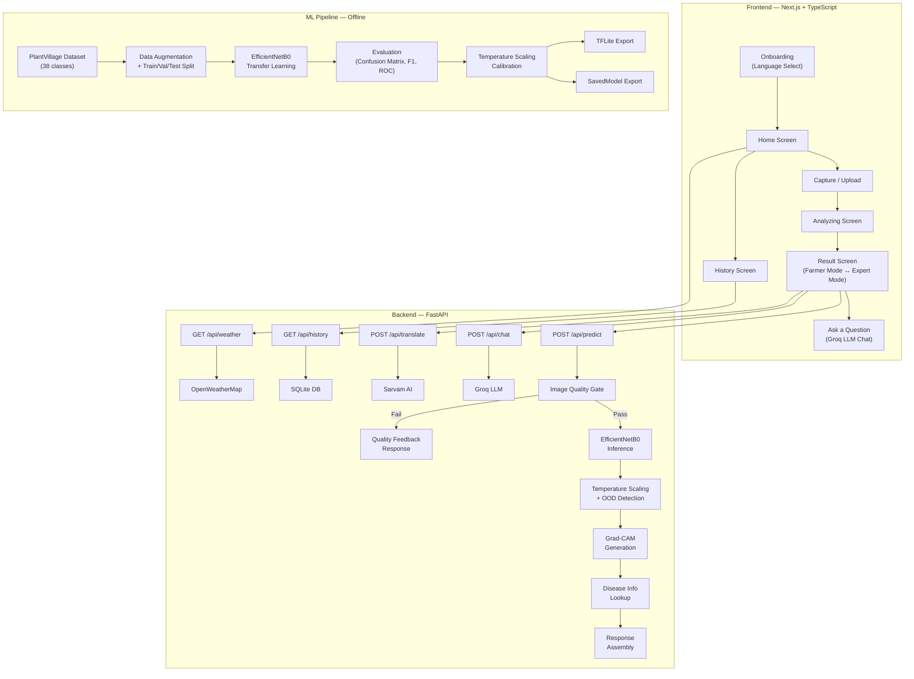
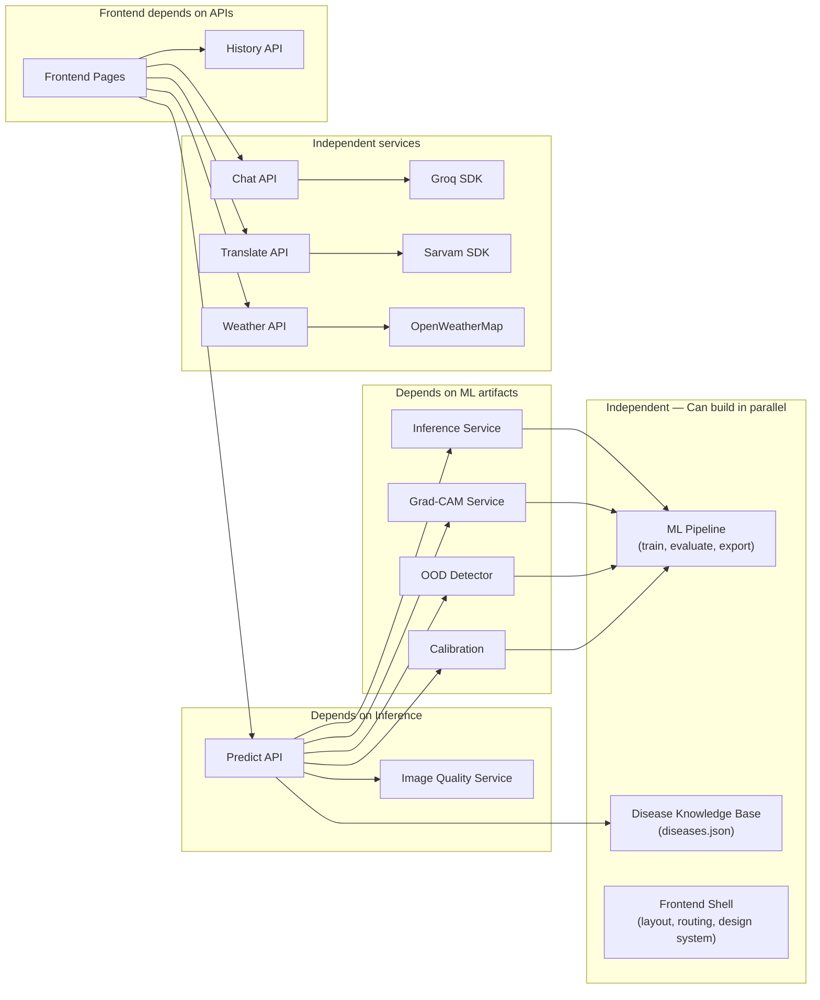

# CropDoctor AI — Implementation Plan

A production-quality AI crop disease assistant designed for low-literacy farmers on low-end Android devices. Not a demo — a defensible, shippable product.

---

## System Architecture



---

## Honest Technical Assessment

Before we build, here are things I want to flag — because honesty is a feature, not a bug.

> [!IMPORTANT]
> **PlantVillage dataset covers 14 crops × 38 classes.** It does NOT cover every Indian crop. A farmer scanning sugarcane, rice, or cotton (very common in India) will get an out-of-distribution result. Our OOD detection and "Unknown Disease" flow isn't just nice-to-have — it's the most important safety feature we build.

> [!WARNING]
> **Disease progression prediction, nutrient deficiency detection, and soil analysis are NOT possible** with PlantVillage data alone. If we include any such feature, it must be clearly labeled as "General agronomy guidance, not a trained prediction." The plan below does NOT include these — we won't pretend the model can do what it can't.

> [!NOTE]
> **Offline TFLite inference** is specified but our frontend is Next.js (web-based). True offline TFLite runs natively on Android via Kotlin/Java. In a PWA, we can use TensorFlow.js with a WASM/WebGL backend and a converted TFLite model. This is technically honest and achievable — but it's TF.js offline, not TFLite native. I'll call this out in the UI as well. If you want native Android, that's a separate React Native / Kotlin milestone.

> [!NOTE]
> **Weather-based advisory** uses heuristic rules (e.g., "humidity > 80% → fungal risk"), not a trained model. This will be clearly labeled in the UI as rule-based advisory, which is scientifically valid agronomy practice — but it's not ML.

---

## User Review Required

> [!IMPORTANT]
> **Tech stack clarification:** You specified TailwindCSS, but your development rules also say "no shortcuts." TailwindCSS is a reasonable choice for rapid, consistent UI development — I'll use it as specified. Confirm you want **TailwindCSS v4** (latest, CSS-first config) or **v3** (JS config, more documented)?

> [!IMPORTANT]
> **Dataset:** I'll use the [PlantVillage dataset from Kaggle](https://www.kaggle.com/datasets/abdallahalidev/plantvillage-dataset) (54,305 images, 38 classes). Do you already have it downloaded, or should I include download instructions in Milestone 1?

> [!IMPORTANT]
> **API Keys needed before we start building Milestones 4+:**
> - Groq API key (free tier: https://console.groq.com)
> - Sarvam AI API key (free tier: https://www.sarvam.ai)
> - OpenWeatherMap API key (free tier: https://openweathermap.org/api)
> 
> No keys are needed for Milestones 1-3 (ML pipeline + core backend + core frontend). We can start building immediately.

---

## Open Questions

> [!IMPORTANT]
> 1. **Deployment target for the hackathon demo:** Will you demo from `localhost`, or do you need deployment (Vercel + Railway/Render)? This affects how I structure environment configs.
> 2. **Do you have a GPU available for training?** EfficientNetB0 fine-tuning on PlantVillage takes ~15 min on a T4 GPU, ~2+ hours on CPU. If no GPU, I can provide a Colab notebook for training only.
> 3. **Regional languages beyond Hindi and English?** You mentioned "regional language" in onboarding. Which one(s)? Tamil, Telugu, Marathi, Kannada? Sarvam supports 11+ languages.
> 4. **Voice/TTS:** Should the "Speak This" button use Sarvam's Bulbul TTS (higher quality, requires network) or the browser's built-in `SpeechSynthesis` API (works offline, lower quality Hindi)? I recommend Sarvam online + browser fallback offline.

---

## Folder Structure

```
crop/
├── backend/                          # FastAPI application
│   ├── app/
│   │   ├── __init__.py
│   │   ├── main.py                   # FastAPI app factory, CORS, lifespan
│   │   ├── config.py                 # Settings via pydantic-settings + env vars
│   │   ├── dependencies.py           # Dependency injection (model loader, DB)
│   │   │
│   │   ├── api/                      # Route layer — thin, delegates to services
│   │   │   ├── __init__.py
│   │   │   ├── predict.py            # POST /api/predict
│   │   │   ├── chat.py               # POST /api/chat
│   │   │   ├── translate.py          # POST /api/translate
│   │   │   ├── weather.py            # GET  /api/weather
│   │   │   ├── history.py            # CRUD /api/history
│   │   │   └── health.py             # GET  /api/health
│   │   │
│   │   ├── services/                 # Business logic layer
│   │   │   ├── __init__.py
│   │   │   ├── inference.py          # Model loading, prediction, temp scaling
│   │   │   ├── image_quality.py      # Blur, brightness, leaf detection
│   │   │   ├── gradcam.py            # Grad-CAM generation
│   │   │   ├── disease_info.py       # Disease knowledge base lookup
│   │   │   ├── ood_detector.py       # Out-of-distribution detection
│   │   │   ├── chat_service.py       # Groq LLM integration
│   │   │   ├── translation.py        # Sarvam AI integration
│   │   │   ├── weather.py            # OpenWeatherMap + agro rules
│   │   │   └── history.py            # History persistence
│   │   │
│   │   ├── models/                   # Pydantic schemas (request/response)
│   │   │   ├── __init__.py
│   │   │   ├── prediction.py
│   │   │   ├── quality.py
│   │   │   ├── chat.py
│   │   │   ├── weather.py
│   │   │   └── history.py
│   │   │
│   │   ├── db/                       # Database layer
│   │   │   ├── __init__.py
│   │   │   ├── database.py           # SQLite connection, migration
│   │   │   └── repositories.py       # Data access (Repository pattern)
│   │   │
│   │   └── core/                     # Cross-cutting concerns
│   │       ├── __init__.py
│   │       ├── exceptions.py         # Custom exception hierarchy
│   │       ├── security.py           # Upload validation, filename sanitization
│   │       └── constants.py          # Disease names, class mappings, thresholds
│   │
│   ├── ml/                           # ML pipeline (offline, not served)
│   │   ├── train.py                  # Training script
│   │   ├── evaluate.py               # Evaluation + metrics generation
│   │   ├── calibrate.py              # Temperature scaling post-hoc
│   │   ├── export.py                 # SavedModel → TFLite conversion
│   │   ├── data_utils.py             # Dataset loading, augmentation, splits
│   │   └── configs/
│   │       └── train_config.yaml     # Hyperparameters, paths
│   │
│   ├── data/                         # Data directory (gitignored)
│   │   ├── raw/                      # PlantVillage dataset
│   │   ├── processed/                # Train/val/test splits
│   │   └── uploads/                  # User-uploaded images
│   │
│   ├── models/                       # Saved model artifacts (gitignored)
│   │   ├── efficientnet_b0/          # SavedModel format
│   │   ├── efficientnet_b0.tflite    # TFLite model
│   │   └── calibration.json          # Temperature scaling params
│   │
│   ├── knowledge/                    # Disease knowledge base
│   │   └── diseases.json             # 38-class disease info, remedies, icons
│   │
│   ├── tests/
│   │   ├── test_predict.py
│   │   ├── test_quality.py
│   │   ├── test_gradcam.py
│   │   ├── test_ood.py
│   │   └── test_chat.py
│   │
│   ├── requirements.txt
│   ├── .env.example
│   └── Dockerfile
│
├── frontend/                         # Next.js application
│   ├── src/
│   │   ├── app/                      # App Router pages
│   │   │   ├── layout.tsx            # Root layout, font loading, providers
│   │   │   ├── page.tsx              # Onboarding / Language select
│   │   │   ├── home/
│   │   │   │   └── page.tsx          # Home screen
│   │   │   ├── capture/
│   │   │   │   └── page.tsx          # Camera + upload
│   │   │   ├── result/
│   │   │   │   └── page.tsx          # Result (Farmer ↔ Expert)
│   │   │   ├── history/
│   │   │   │   └── page.tsx          # History list
│   │   │   └── chat/
│   │   │       └── page.tsx          # Ask a question
│   │   │
│   │   ├── components/               # Reusable UI components
│   │   │   ├── ui/                   # Atomic design primitives
│   │   │   │   ├── Button.tsx
│   │   │   │   ├── Badge.tsx
│   │   │   │   ├── Card.tsx
│   │   │   │   ├── LoadingAnimation.tsx
│   │   │   │   ├── ConfidenceIndicator.tsx  # 3-dot farmer / % expert
│   │   │   │   ├── ColorBadge.tsx           # Green/yellow/red status
│   │   │   │   ├── VoiceButton.tsx
│   │   │   │   └── ModeToggle.tsx           # Farmer ↔ Expert
│   │   │   │
│   │   │   ├── capture/
│   │   │   │   ├── CameraViewfinder.tsx
│   │   │   │   ├── LeafGuideOverlay.tsx
│   │   │   │   └── QualityIndicator.tsx     # Live traffic-light dot
│   │   │   │
│   │   │   ├── result/
│   │   │   │   ├── FarmerResult.tsx
│   │   │   │   ├── ExpertResult.tsx
│   │   │   │   ├── RemedyCard.tsx
│   │   │   │   ├── WeatherAdvisory.tsx
│   │   │   │   └── GradCAMOverlay.tsx
│   │   │   │
│   │   │   └── layout/
│   │   │       ├── OfflineBadge.tsx
│   │   │       └── NavBar.tsx
│   │   │
│   │   ├── hooks/                    # Custom React hooks
│   │   │   ├── useCamera.ts
│   │   │   ├── usePrediction.ts
│   │   │   ├── useTranslation.ts
│   │   │   ├── useVoice.ts
│   │   │   ├── useWeather.ts
│   │   │   ├── useOnlineStatus.ts
│   │   │   └── useMode.ts           # Farmer/Expert toggle state
│   │   │
│   │   ├── lib/                      # Utilities
│   │   │   ├── api.ts                # Typed API client (fetch wrapper)
│   │   │   ├── constants.ts          # Shared constants, color mappings
│   │   │   ├── i18n.ts               # Internationalization strings
│   │   │   └── imageUtils.ts         # Client-side compression, validation
│   │   │
│   │   ├── context/                  # React Context providers
│   │   │   ├── LanguageContext.tsx
│   │   │   └── ModeContext.tsx
│   │   │
│   │   └── types/                    # TypeScript interfaces
│   │       ├── prediction.ts
│   │       ├── disease.ts
│   │       └── weather.ts
│   │
│   ├── public/
│   │   ├── icons/                    # Agri icons (Lucide-based + custom)
│   │   ├── animations/               # Lottie/CSS loading animations
│   │   └── sounds/                   # Optional feedback sounds
│   │
│   ├── tailwind.config.ts
│   ├── next.config.ts
│   ├── tsconfig.json
│   ├── package.json
│   └── .env.local.example
│
├── docs/                             # Documentation
│   ├── ARCHITECTURE.md
│   ├── API.md
│   └── DATASET.md
│
├── .gitignore
├── README.md
└── docker-compose.yml                # Full-stack local dev
```

---

## Dependency Graph



---

## Milestone Plan

### Milestone 0 — Project Scaffold & Design System *(~30 min)*

**What:** Initialize both projects, install dependencies, establish the design system, verify everything compiles.

| Component | Tasks |
|-----------|-------|
| **Backend** | `pip install` dependencies, create FastAPI app factory, health endpoint, CORS config, `.env` setup |
| **Frontend** | `npx create-next-app`, install Tailwind + Lucide icons + Google Fonts (Inter), create design tokens (colors, spacing, typography), build atomic `Button`, `Badge`, `Card` components |
| **Verification** | Backend serves `GET /api/health` → `{"status": "ok"}`. Frontend renders a styled placeholder. Both compile clean. |

---

### Milestone 1 — ML Pipeline *(~60 min)*

**What:** Train EfficientNetB0 on PlantVillage, evaluate rigorously, calibrate, export to TFLite.

| Step | Details |
|------|---------|
| **Data prep** | Download PlantVillage → stratified 80/10/10 split → save split indices for reproducibility |
| **Augmentation** | RandomFlip, RandomRotation (±15°), RandomZoom (0.9–1.1), RandomBrightness, RandomContrast — applied only to training set |
| **Model** | `EfficientNetB0(weights='imagenet', include_top=False)` → GlobalAveragePooling2D → Dropout(0.3) → Dense(38, softmax) |
| **Training** | Freeze base → train head 10 epochs → unfreeze top 20 layers → fine-tune 20 epochs with lr=1e-4, ReduceLROnPlateau, EarlyStopping(patience=5), ModelCheckpoint |
| **Evaluation** | Confusion matrix, per-class precision/recall/F1, macro F1, classification report, ROC curves (one-vs-rest) |
| **Calibration** | Temperature scaling on validation set (single learned parameter T, optimized via NLL) |
| **Export** | SavedModel + TFLite (float16 quantization for size) |
| **Verification** | Inference on 10 test images matches expected classes. Calibration ECE < 0.05. TFLite model < 20MB. |

---

### Milestone 2 — Core Backend (Prediction Pipeline) *(~45 min)*

**What:** Image quality gate → inference → OOD detection → Grad-CAM → disease info → full prediction response.

| Component | Details |
|-----------|---------|
| **Image Quality** | Laplacian variance (blur), mean brightness (dark/overexposed), contour analysis (leaf presence). Returns specific failure reason + remediation icon. |
| **Inference** | Load SavedModel, preprocess to 224×224, run prediction, apply temperature scaling |
| **OOD Detection** | Maximum softmax probability threshold + entropy threshold. If max_prob < 0.4 OR entropy > 2.5 → "Unknown Disease" |
| **Grad-CAM** | Extract activations from `top_conv` layer, compute gradient-weighted class activation map, overlay on original image, save as PNG |
| **Disease Info** | Lookup from `diseases.json` → farmer-friendly name, description, remedy, severity color, remedy cost estimate |
| **Response schema** | `PredictionResponse` with top-3 predictions, Grad-CAM URL, quality status, disease info, severity level |
| **Verification** | `POST /api/predict` with a real tomato leaf image → correct disease, Grad-CAM generated, quality gate works for blurry/dark images |

---

### Milestone 3 — Frontend Core Flow *(~90 min)*

**What:** Complete user journey from language select → capture → result, in both Farmer and Expert modes.

| Page | Key Implementation Details |
|------|---------------------------|
| **Onboarding** | Full-screen, 3 large language buttons (Hindi 🇮🇳, English 🇬🇧, regional). Saves to localStorage. Shown only on first visit. |
| **Home** | Giant camera button (centered, 120×120px), animated pulse. Icon row below: History, Settings. Offline badge (green, reassuring). |
| **Capture** | `getUserMedia` camera with leaf-shaped SVG overlay. Real-time Laplacian blur check via canvas (client-side pre-check). Gallery upload fallback. Client-side image compression (max 1MB) before upload. |
| **Analyzing** | Leaf examination animation (CSS keyframes, no Lottie dependency). 2-second minimum display. Localized caption. |
| **Result — Farmer Mode** | Large color badge (green/yellow/red), plain-language verdict (no Latin names), 3-dot confidence scale, remedy card with cost, "Speak This" button, weather advisory if available. |
| **Result — Expert Mode** | Same screen, expanded: confidence %, top-3 bar chart, Grad-CAM with caption, technical disease name, model version footer. |
| **Mode toggle** | Top-right pill toggle, persistent via context. Switching re-renders in place, no navigation. |
| **Verification** | Full flow works on Chrome mobile emulator (Pixel 5, 393×851). Both modes render correctly. Offline badge appears when network is disconnected. |

---

### Milestone 4 — History & Persistence *(~30 min)*

**What:** Save every prediction to SQLite, display in a scrollable history list.

| Component | Details |
|-----------|---------|
| **Backend** | SQLite table: `predictions(id, image_path, top_prediction, confidence, severity, gradcam_path, disease_info_json, created_at)`. CRUD endpoints. |
| **Frontend** | Vertical list: thumbnail + color dot + date + verdict. Tap reopens full result. Empty state with icon + explanation. |
| **Verification** | Make 3 predictions → all appear in history → tapping one reopens the correct result. |

---

### Milestone 5 — Translation & Voice *(~30 min)*

**What:** Hindi translation of all results via Sarvam AI, voice readout via Sarvam TTS + browser fallback.

| Component | Details |
|-----------|---------|
| **Translation service** | `POST /api/translate` → Sarvam Mayura API. Cache translations in SQLite to avoid redundant API calls. |
| **Voice** | "Speak This" button → Sarvam Bulbul TTS (online) → browser `SpeechSynthesis` (offline fallback). |
| **i18n** | All UI strings in `i18n.ts` with `en` and `hi` keys. Language context drives rendering. |
| **Verification** | Switch to Hindi → all UI + result text in Hindi. Tap "Speak This" → audio plays. Works with browser TTS when offline. |

---

### Milestone 6 — LLM Chat (Ask a Question) *(~30 min)*

**What:** Groq-powered contextual chat about the diagnosed disease.

| Component | Details |
|-----------|---------|
| **Backend** | `POST /api/chat` → Groq `llama-3.3-70b-versatile`. System prompt includes: disease context from current prediction, farmer-appropriate language instruction, safety guardrails (no medical advice, no pesticide dosage without professional consultation). |
| **Frontend** | Chat-style UI reached via "Have a question?" on result screen. Large mic button (browser `SpeechRecognition` for voice input). Responses rendered as short spoken-style sentences. |
| **Guardrails** | LLM is instructed to: stay within agriculture domain, never prescribe exact chemical dosages, recommend consulting local agriculture officer for serious cases. |
| **Verification** | Ask "How do I treat this?" → relevant, safe, farmer-friendly response in selected language. |

---

### Milestone 7 — Weather Advisory *(~20 min)*

**What:** Location-based weather data with rule-based agricultural advice.

| Component | Details |
|-----------|---------|
| **Backend** | `GET /api/weather?lat=X&lon=Y` → OpenWeatherMap current + 3-day forecast. Heuristic rules engine: humidity > 80% → "High fungal risk, inspect leaves", rain in 24h → "Delay spraying", temp > 35°C → "Water stress risk". |
| **Frontend** | Weather advisory card on result screen (only shown when location available + weather relevant to diagnosis). Icon + one-line advice. |
| **Honesty** | Card footer: "Based on weather rules, not AI prediction" |
| **Verification** | Mock weather data with high humidity → fungal warning appears. No weather → card hidden gracefully. |

---

### Milestone 8 — Offline Support (PWA) *(~30 min)*

**What:** Service worker for offline caching, TensorFlow.js for offline inference.

| Component | Details |
|-----------|---------|
| **PWA** | `next-pwa` or manual service worker. Cache: app shell, static assets, disease knowledge base, last 10 history items. |
| **Offline inference** | TF.js with WASM backend, converted from TFLite. Runs inference client-side when offline. Quality check also runs client-side (canvas-based Laplacian). |
| **Sync** | When back online, sync offline predictions to backend for history persistence. |
| **Verification** | Disconnect network → take photo → get prediction → reconnect → prediction appears in server history. |

---

### Milestone 9 — Polish, Testing & Demo Prep *(~45 min)*

**What:** End-to-end testing, performance optimization, demo script.

| Task | Details |
|------|---------|
| **Testing** | Unit tests for all services. Integration test for full predict pipeline. Edge cases: corrupt image, oversized file, empty upload, non-leaf image, network timeout. |
| **Performance** | Lazy-load Grad-CAM images. Compress uploads client-side. Cache disease info. Measure and log inference time. |
| **Security audit** | Validate file types (JPEG/PNG only), reject > 10MB, sanitize filenames, no hardcoded secrets. |
| **Demo script** | Prepare 5 demo images (healthy, bacterial spot, early blight, unknown/OOD, blurry). Write demo flow. |
| **README** | Setup instructions, architecture diagram, screenshots, tech decisions, team credits. |

---

## Potential Risks & Mitigations

| Risk | Impact | Mitigation |
|------|--------|------------|
| **No GPU for training** | Training takes 2+ hours on CPU | Provide Google Colab notebook; pre-train and commit model artifacts |
| **PlantVillage bias** | Dataset is lab-shot leaves on solid backgrounds; field photos have soil, hands, multiple leaves | Aggressive augmentation (background noise, color jitter); image quality gate rejects non-ideal captures; OOD detection catches distribution shift |
| **Sarvam/Groq API downtime** | Translation and chat fail | Graceful degradation: browser TTS fallback, cached translations, chat shows "offline — try later" |
| **Large model size** | TFLite too big for low-end phones | Float16 quantization (cuts size ~50%); EfficientNetB0 is already small (~16MB fp16) |
| **Farmer uploads non-leaf images** | Nonsensical predictions | Image quality gate checks for leaf presence via contour analysis + green channel dominance; OOD detector catches remaining cases |
| **Overconfident wrong predictions** | Farmer acts on bad advice | Temperature scaling reduces overconfidence; OOD detection triggers "Unknown"; low-confidence states clearly shown; Farmer Mode never shows raw confidence % |
| **Hackathon time pressure** | Can't finish all milestones | Milestones are ordered by impact. M0-M3 give a complete working demo. M4-M7 are high-value additions. M8-M9 are polish. Even stopping at M3, the project is strong. |

---

## Verification Plan

### Automated Tests
```bash
# Backend
cd backend && python -m pytest tests/ -v --cov=app

# Frontend
cd frontend && npm run lint && npm run build
```

### Manual Verification (per milestone)
- **M0:** Both servers start, health endpoint responds
- **M1:** Model trains, metrics logged, TFLite exported
- **M2:** `curl` predict endpoint with test image → correct response
- **M3:** Full flow in Chrome DevTools mobile emulator
- **M4:** Predictions persist and reload from history
- **M5:** Hindi UI + voice readout works
- **M6:** Chat answers disease questions appropriately
- **M7:** Weather card appears with advisory
- **M8:** Offline prediction works after disconnecting
- **M9:** All edge cases handled, demo runs smoothly

### Demo Verification
- 5 prepared images covering: healthy leaf, known disease, unknown/OOD, blurry image, dark image
- Full flow demonstrated in both Farmer Mode and Expert Mode
- Hindi language switch demonstrated
- Voice readout demonstrated
- Weather advisory demonstrated
- Chat demonstrated

---

## Page-by-Page UI Wireframe (Text)

### 1. Onboarding (First Launch Only)
```
┌─────────────────────────┐
│                         │
│    🌾 CropDoctor AI     │
│    "Your Crop Helper"   │
│                         │
│  ┌───────────────────┐  │
│  │  🇮🇳  हिंदी         │  │  ← Large tap target, full-width
│  └───────────────────┘  │
│  ┌───────────────────┐  │
│  │  🇬🇧  English      │  │
│  └───────────────────┘  │
│  ┌───────────────────┐  │
│  │  🏳️  मराठी         │  │  ← Or Telugu/Tamil — configurable
│  └───────────────────┘  │
│                         │
│  (No skip, no sign-up)  │
└─────────────────────────┘
```

### 2. Home Screen
```
┌─────────────────────────┐
│ 🌾 CropDoctor    [👤⚙️] │  ← Expert toggle in settings
│─────────────────────────│
│                         │
│                         │
│     ┌─────────────┐     │
│     │             │     │
│     │   📸 Scan   │     │  ← Giant pulsing button, 120×120
│     │   Your Leaf │     │
│     │             │     │
│     └─────────────┘     │
│                         │
│                         │
│  ┌──────┐  ┌──────────┐ │
│  │📋    │  │🌤️        │ │
│  │History│  │Weather   │ │
│  └──────┘  └──────────┘ │
│                         │
│ ┌─────────────────────┐ │
│ │ ✅ Working Offline  │ │  ← Green badge, reassuring
│ └─────────────────────┘ │
└─────────────────────────┘
```

### 3. Capture Screen
```
┌─────────────────────────┐
│ ← Back         🟢 Sharp │  ← Live quality dot
│─────────────────────────│
│ ┌─────────────────────┐ │
│ │                     │ │
│ │   ╭─── 🍃 ───╮     │ │  ← Leaf-shaped guide overlay
│ │   │           │     │ │
│ │   │  Camera   │     │ │
│ │   │  Feed     │     │ │
│ │   │           │     │ │
│ │   ╰───────────╯     │ │
│ │                     │ │
│ └─────────────────────┘ │
│ "Fit one leaf inside"   │
│                         │
│     ┌─────────────┐     │
│     │  📸 Capture │     │  ← Large capture button
│     └─────────────┘     │
│                         │
│     📁 Upload from      │  ← Smaller, secondary
│        gallery          │
└─────────────────────────┘
```

### 4. Analyzing Screen
```
┌─────────────────────────┐
│                         │
│                         │
│                         │
│      🍃 ← ── → 🔍      │  ← Leaf-to-magnifying animation
│                         │
│   "Checking your leaf..." │
│                         │
│      ● ● ●             │  ← Animated dots
│                         │
│                         │
│                         │
└─────────────────────────┘
```

### 5. Result — Farmer Mode
```
┌─────────────────────────┐
│ ← Back    [🌾 Farmer ▼] │  ← Mode toggle
│─────────────────────────│
│ ┌─────────────────────┐ │
│ │ 🟡 Needs Attention  │ │  ← Color-coded badge
│ │ "White circular      │ │
│ │  spots on leaves"    │ │  ← Plain language, no jargon
│ └─────────────────────┘ │
│                         │
│ 🔊 Speak This           │  ← Voice button, prominent
│                         │
│ Confidence: ●●○         │  ← 3-dot scale (not %)
│ "Not fully sure"        │
│ ┌────┐ ┌────┐           │
│ │Alt1│ │Alt2│           │  ← Alternate matches, tappable
│ └────┘ └────┘           │
│                         │
│ ┌─────────────────────┐ │
│ │ 🧴 Spray Neem Oil   │ │  ← Remedy card
│ │    ~₹70 per bottle  │ │
│ └─────────────────────┘ │
│                         │
│ ┌─────────────────────┐ │
│ │ 🌧️ Rain tomorrow —  │ │  ← Weather advisory
│ │    delay spraying    │ │
│ └─────────────────────┘ │
│                         │
│ 📖 See Full Details     │  ← Expands to Expert Mode
│ ❓ Have a Question?     │  ← Goes to chat
└─────────────────────────┘
```

### 6. Result — Expert Mode (same screen, expanded)
```
┌─────────────────────────┐
│ ← Back    [🔬 Expert ▼] │
│─────────────────────────│
│ [Same badge + verdict]  │
│                         │
│ Confidence: 73.2%       │
│ ┌─────────────────────┐ │
│ │ Cercospora: ██████▓ 73%│
│ │ Alternaria: ████░░░ 18%│
│ │ Healthy:    █░░░░░░  5%│
│ └─────────────────────┘ │
│                         │
│ ┌─────────────────────┐ │
│ │ [Original] [GradCAM]│ │  ← Side-by-side or overlay
│ │                     │ │
│ │ "Model focused on   │ │  ← Caption under Grad-CAM
│ │  white spots along  │ │
│ │  leaf margin"       │ │
│ └─────────────────────┘ │
│                         │
│ Disease: Cercospora     │
│ leaf spot               │
│                         │
│ Why this remedy:        │
│ "Cercospora thrives..." │
│                         │
│ ──────────────────────  │
│ Model: EfficientNetB0   │
│ v1.0 · Updated Aug 2026│
│ Calibrated · Temp=1.42  │
└─────────────────────────┘
```

### 7. History Screen
```
┌─────────────────────────┐
│ ← Back      History     │
│─────────────────────────│
│ ┌─────────────────────┐ │
│ │ 🖼️ 🟡 Aug 6         │ │  ← Thumb + color dot + date
│ │ "White spots"       │ │
│ └─────────────────────┘ │
│ ┌─────────────────────┐ │
│ │ 🖼️ 🟢 Aug 5         │ │
│ │ "Healthy leaf"      │ │
│ └─────────────────────┘ │
│ ┌─────────────────────┐ │
│ │ 🖼️ 🔴 Aug 4         │ │
│ │ "Late Blight—act    │ │
│ │  now"               │ │
│ └─────────────────────┘ │
│                         │
│ (Empty state if none:)  │
│ 📋 "No scans yet.      │
│  Scan your first leaf!" │
└─────────────────────────┘
```

### 8. Chat Screen
```
┌─────────────────────────┐
│ ← Back    Ask a Question│
│─────────────────────────│
│                         │
│ Context: "White spots   │
│ on tomato leaf"         │
│                         │
│ ┌─────────────────────┐ │
│ │ 🤖 "This looks like │ │
│ │ a fungal infection.  │ │
│ │ Neem oil works well."│ │
│ └─────────────────────┘ │
│                         │
│ ┌─────────────────────┐ │
│ │ 👤 "When should I   │ │
│ │ spray?"             │ │
│ └─────────────────────┘ │
│                         │
│ ┌─────────────────────┐ │
│ │ 🤖 "Early morning   │ │
│ │ or late evening..."  │ │
│ └─────────────────────┘ │
│                         │
│ ┌──────────────┐ ┌────┐ │
│ │ Type here... │ │ 🎤 │ │  ← Mic button large
│ └──────────────┘ └────┘ │
└─────────────────────────┘
```

---

## What Makes This Project Win

| Dimension | Why We're Strong |
|-----------|-----------------|
| **ML Rigor** | Not just accuracy — calibration, OOD detection, per-class metrics, Grad-CAM explainability, honest confidence communication |
| **Architecture** | Clean separation (API → Service → Model), dependency injection, typed schemas, repository pattern — production patterns, not student code |
| **UX** | Farmer-first design validated against WHO/Kisan app principles. Two-mode system. Voice-first. Color-coded. One action per screen. |
| **Honesty** | OOD detection returns "Unknown" instead of hallucinating. Weather advice labeled as rule-based. No fake ML. |
| **Completeness** | End-to-end: capture → quality gate → inference → explanation → remedy → translation → voice → chat → history → offline |
| **Technical Depth** | Temperature scaling, Grad-CAM, Laplacian quality detection, PWA offline, TF.js fallback — each is a talking point during judging |

---

## Ready to Build

Awaiting your approval. Once confirmed, I'll begin with **Milestone 0 — Project Scaffold & Design System**. Each milestone will compile and run before I move to the next.
